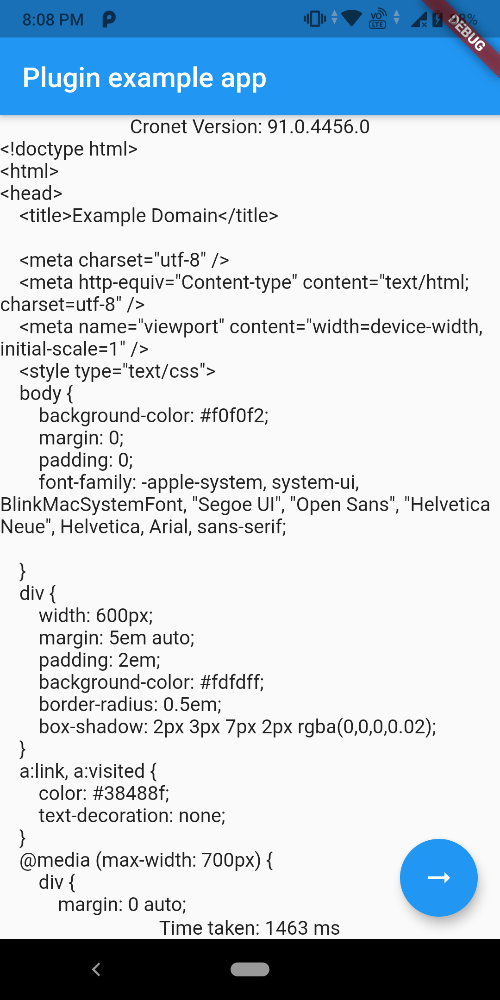

# flutter_cronet_sample

A flutter plugin for https://github.com/unsuitable001/dart_cronet_sample

This repo only contains platform specific implementations. Soon, it will be merged with the main package repo.

## Demo

### Android

## Compilation

Cronet's pre-built binary is provided for `arm64-v8a` only. If you want to make for any other archs, follow the cronet's build instructions. Compiling the wrapper library will require a full installation of `android ndk` too, along with `cmake` and `Dart SDK 2.12` header files. Also, do not forget to remove `abiFilters` from `gradle` file.
